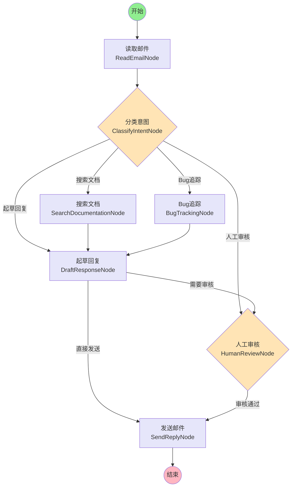

# Email Agent DAG 图

## 流程图

## 节点说明

| 节点名称 | 类型 | 说明 |
|---------|------|------|
| START | 起始节点 | 工作流开始 |
| read_email | 处理节点 | 读取邮件内容 |
| classify_intent | 条件节点 | 使用AI分类邮件意图 |
| search_documentation | 处理节点 | 搜索相关文档 |
| bug_tracking | 处理节点 | 处理Bug追踪相关事务 |
| draft_response | 处理节点 | 起草回复内容 |
| human_review | 条件节点 | 人工审核（支持中断） |
| send_reply | 处理节点 | 发送回复邮件 |
| END | 结束节点 | 工作流结束 |

## 流程说明

1. **读取邮件**: 从输入中读取邮件内容
2. **意图分类**: 使用AI分析邮件类型和意图
3. **分支处理**:
   - 技术文档查询 → 搜索文档 → 起草回复
   - Bug报告 → Bug追踪 → 起草回复
   - 需要人工介入 → 直接进入人工审核
   - 普通咨询 → 直接起草回复
4. **起草回复**: 根据上下文生成回复草稿
5. **人工审核**: 可选的人工审核环节（配置了中断点）
6. **发送邮件**: 发送最终回复

## 特殊配置

- **检查点保存**: 使用 MemorySaver 保存状态
- **中断机制**: 在 `human_review` 节点前设置中断，支持人工干预
- **条件边**: 多个节点根据状态动态决定下一个节点
